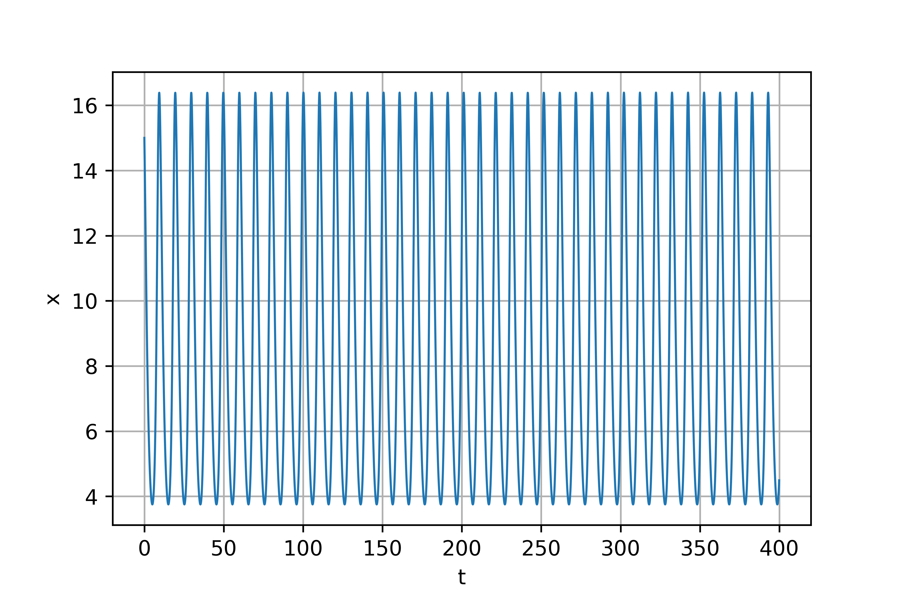
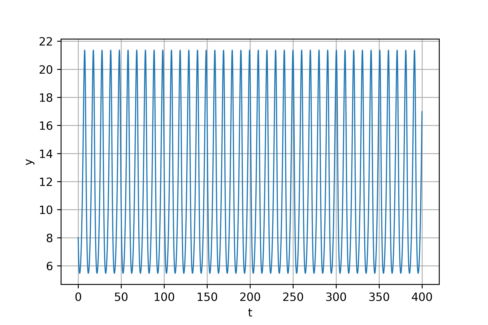
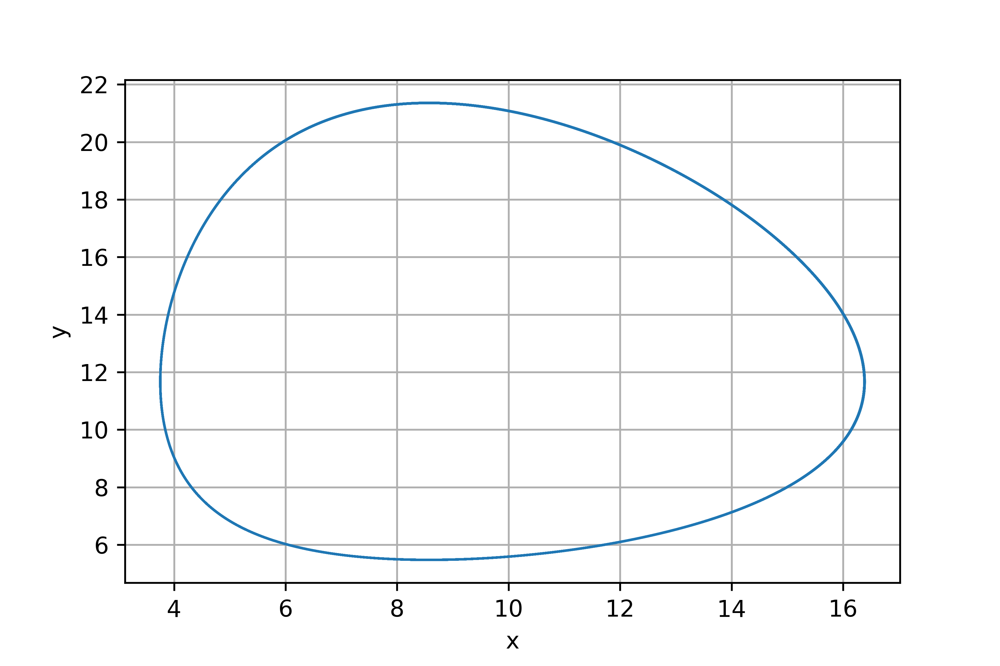

---
## Front matter
lang: ru-RU
title: Модель хищник-жертва
author: |
	Анна Поленикова
institute: |
	\inst RUDN University, Moscow, Russian Federation
date: 2021

## Formatting
toc: false
slide_level: 2
theme: metropolis
mainfont: Times New Roman
romanfont: Times New Roman
sansfont: Times New Roman
monofont: Times New Roman
mainfontoptions: Ligatures=TeX
romanfontoptions: Ligatures=TeX
pdf-engine: xelatex
header-includes: 
 - \metroset{progressbar=frametitle,sectionpage=progressbar,numbering=fraction}
 - '\makeatletter'
 - '\beamer@ignorenonframefalse'
 - '\makeatother'
aspectratio: 43
section-titles: true
---

# Цель работы и задание

## Цель работы
Цель лабораторной работы №5 - ознакомление с моделью хищник-жертва.

## Задание

Вариант 38

Для модели "хищник-жертва": 

$$ \begin{cases} \frac{dx}{dt} = (-0.7x(t) + 0.06x(t)y(t)) \\
\frac{dy}{dt} = (0.6y(t) - 0.07x(t)y(t)) \end{cases} $$

Построить график зависимости численности хищников от численности жертв и графики изменения численности хищников и численности жертв при 
следующих начальных условиях: $x_0=8$, $y_0=15$. Найти стационарное состояние системы.

# Теоретическая справка

## Теоретическая справка

Простейшая модель взаимодействия двух видов типа «хищник — жертва» -
модель Лотки-Вольтерры. Данная двувидовая модель основывается на
следующих предположениях:

1. Численность популяции жертв x и хищников y зависят только от времени
(модель не учитывает пространственное распределение популяции на
занимаемой территории)
2. В отсутствии взаимодействия численность видов изменяется по модели
Мальтуса, при этом число жертв увеличивается, а число хищников падает
3. Естественная смертность жертвы и естественная рождаемость хищника
считаются несущественными
4. Эффект насыщения численности обеих популяций не учитывается
5. Скорость роста численности жертв уменьшается пропорционально
численности хищников

## Теоретическая справка

$$ \begin{cases} \frac{dx}{dt} = (-ax(t) + bx(t)y(t)) \\
\frac{dy}{dt} = (cy(t) - dx(t)y(t)) \end{cases} $$

В этой модели $x$ – число жертв, $y$ - число хищников. Коэффициент $a$
описывает скорость естественного прироста числа жертв в отсутствие хищников, $с$
- естественное вымирание хищников, лишенных пищи в виде жертв. Вероятность
взаимодействия жертвы и хищника считается пропорциональной как количеству
жертв, так и числу самих хищников ($xy$). Каждый акт взаимодействия уменьшает
популяцию жертв, но способствует увеличению популяции хищников (члены $-bxy$
и $dxy$ в правой части уравнения). 

Стационарное состояние системы будет в точке: $x_0=\frac{c}{d}$, $y_0=\frac{a}{b}$. 

# Выполнение лабораторной работы

## График изменения численности хищников

В результате выполнения программы были получены следующие результаты для изменения численности хищников: (рис. -@fig:001)

{ #fig:001 width=70% }

## График изменения численности жертв

Для изменения численности жертв: (рис. -@fig:002)

{ #fig:002 width=70% }

## График зависимости численности хищников от численности жертв

Для зависимости численности хищников от численности жертв: (рис. -@fig:003)

{ #fig:003 width=70% }

Также были получены следующие стационарные значения: $x_0=11.666666666666666$, $y_0=8.571428571428571$

# Выводы

## Выводы

В результате проделанной лабораторной работы была изучена модель "хищник-жертва".