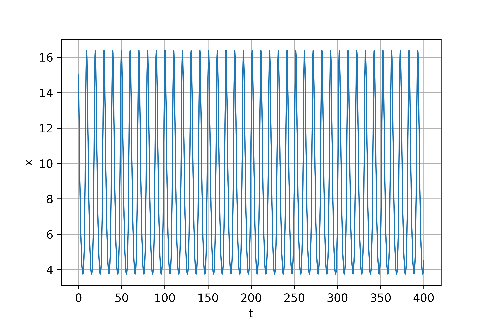

---
# Front matter
lang: ru-RU
title: "Отчет по лабораторной работе №5"
subtitle: "Модель хищник-жертва"
author: "Поленикова Анна Алексеевна"

# Formatting
toc-title: "Содержание"
toc: true # Table of contents
toc_depth: 2
lof: true # List of figures
fontsize: 12pt
linestretch: 1.5
papersize: a4paper
documentclass: scrreprt
polyglossia-lang: russian
polyglossia-otherlangs: english
mainfont: DejaVuSerif
romanfont: DejaVuSerif
sansfont: DejaVuSans
monofont: DejaVuSansMono
mainfontoptions: Ligatures=TeX
romanfontoptions: Ligatures=TeX
sansfontoptions: Ligatures=TeX,Scale=MatchLowercase
monofontoptions: Scale=MatchLowercase
indent: true
pdf-engine: miktex
header-includes:
  - \linepenalty=10 # the penalty added to the badness of each line within a paragraph (no associated penalty node) Increasing the value makes tex try to have fewer lines in the paragraph.
  - \interlinepenalty=0 # value of the penalty (node) added after each line of a paragraph.
  - \hyphenpenalty=50 # the penalty for line breaking at an automatically inserted hyphen
  - \exhyphenpenalty=50 # the penalty for line breaking at an explicit hyphen
  - \binoppenalty=700 # the penalty for breaking a line at a binary operator
  - \relpenalty=500 # the penalty for breaking a line at a relation
  - \clubpenalty=150 # extra penalty for breaking after first line of a paragraph
  - \widowpenalty=150 # extra penalty for breaking before last line of a paragraph
  - \displaywidowpenalty=50 # extra penalty for breaking before last line before a display math
  - \brokenpenalty=100 # extra penalty for page breaking after a hyphenated line
  - \predisplaypenalty=10000 # penalty for breaking before a display
  - \postdisplaypenalty=0 # penalty for breaking after a display
  - \floatingpenalty = 20000 # penalty for splitting an insertion (can only be split footnote in standard LaTeX)
  - \raggedbottom # or \flushbottom
  - \usepackage{float} # keep figures where there are in the text
  - \floatplacement{figure}{H} # keep figures where there are in the text
---

# Цель работы

Цель лабораторной работы №5 - ознакомление с моделью хищник-жертва.

# Задание

Вариант 38

Для модели "хищник-жертва": 

$$ \begin{cases} \frac{dx}{dt} = (-0.7x(t) + 0.06x(t)y(t)) \\
\frac{dy}{dt} = (0.6y(t) - 0.07x(t)y(t)) \end{cases} $$

Построить график зависимости численности хищников от численности жертв и графики изменения численности хищников и численности жертв при 
следующих начальных условиях: $x_0=8$, $y_0=15$. Найти стационарное состояние системы.

# Теоретическая справка

Простейшая модель взаимодействия двух видов типа «хищник — жертва» -
модель Лотки-Вольтерры. Данная двувидовая модель основывается на
следующих предположениях:

1. Численность популяции жертв x и хищников y зависят только от времени
(модель не учитывает пространственное распределение популяции на
занимаемой территории)
2. В отсутствии взаимодействия численность видов изменяется по модели
Мальтуса, при этом число жертв увеличивается, а число хищников падает
3. Естественная смертность жертвы и естественная рождаемость хищника
считаются несущественными
4. Эффект насыщения численности обеих популяций не учитывается
5. Скорость роста численности жертв уменьшается пропорционально
численности хищников

$$ \begin{cases} \frac{dx}{dt} = (-ax(t) + bx(t)y(t)) \\
\frac{dy}{dt} = (cy(t) - dx(t)y(t)) \end{cases} $$

В этой модели $x$ – число жертв, $y$ - число хищников. Коэффициент $a$
описывает скорость естественного прироста числа жертв в отсутствие хищников, $с$
- естественное вымирание хищников, лишенных пищи в виде жертв. Вероятность
взаимодействия жертвы и хищника считается пропорциональной как количеству
жертв, так и числу самих хищников ($xy$). Каждый акт взаимодействия уменьшает
популяцию жертв, но способствует увеличению популяции хищников (члены $-bxy$
и $dxy$ в правой части уравнения). 

Стационарное состояние системы будет в точке: $x_0=\frac{c}{d}$, $y_0=\frac{a}{b}$. 
Если начальные значения задать в стационарном состоянии $x(0)=x_0$, $y(0)=y_0$, 
то в любой момент времени
численность популяций изменяться не будет.

# Выполнение лабораторной работы

Для построения графика зависимости численности хищников от численности жертв и графиков изменения численности хищников и численности жертв был написан следующий код:
```
import numpy as np
from scipy. integrate import odeint
import matplotlib.pyplot as plt
import math

a=-0.7
b=-0.06
c=-0.6
d=-0.07
f0=[15, 8]
def eq(f, t):
    f1, f2=f
    return [a*f1-b*f1*f2, -c*f2+d*f1*f2]
t=np.arange(0, 400, 0.1)
f=odeint(eq, f0, t)
y1=f[:,0]
y2=f[:,1]

graph1=plt.figure(facecolor='white')
plt.plot(t, y1, linewidth=1)
plt.ylabel("x")
plt.xlabel("t")
plt.grid(True)
plt.show

graph2=plt.figure(facecolor='white')
plt.plot(t, y2, linewidth=1)
plt.ylabel("y")
plt.xlabel("t")
plt.grid(True)
plt.show

graph3=plt.figure(facecolor='white')
plt.plot(y1, y2, linewidth=1)
plt.ylabel("y")
plt.xlabel("x")
plt.grid(True)
plt.show

print("xst=", a/b)
print("yst=", c/d)
```

В результате выполнения программы были получены следующие результаты для изменения численности хищников: (рис. -@fig:001)

{ #fig:001 width=70% }

Для изменения численности жертв: (рис. -@fig:002)

{ #fig:002 width=70% }

Для зависимости численности хищников от численности жертв: (рис. -@fig:003)

{ #fig:003 width=70% }

Также были получены следующие стационарные значения: $x_0=11.666666666666666$, $y_0=8.571428571428571$

# Выводы

В результате проделанной лабораторной работы была изучена модель "хищник-жертва".
