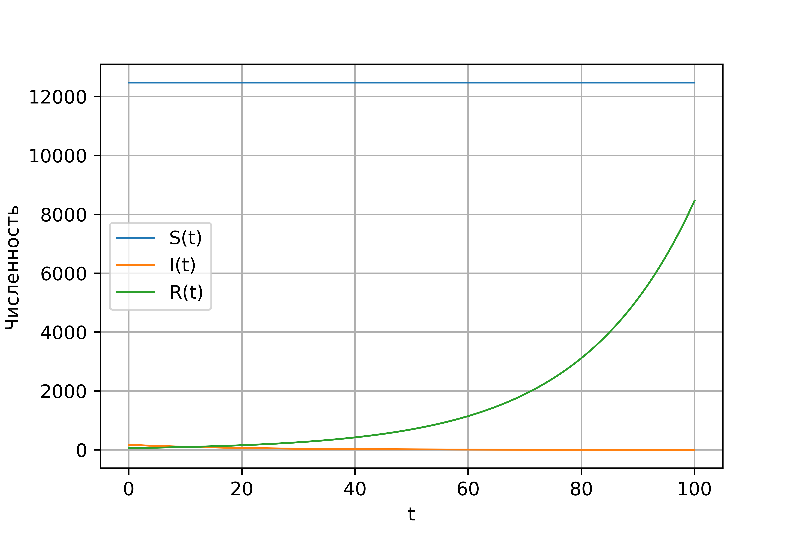
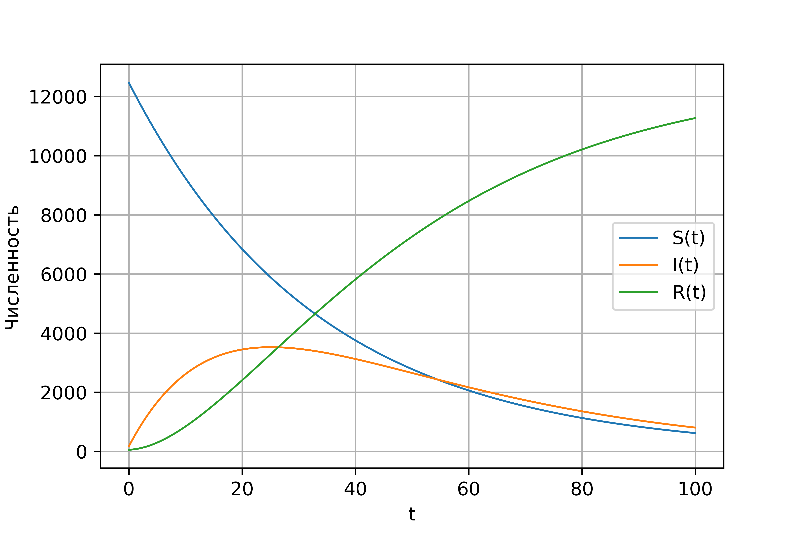

---
# Front matter
lang: ru-RU
title: "Отчет по лабораторной работе №6"
subtitle: "Задача об эпидемии"
author: "Поленикова Анна Алексеевна"

# Formatting
toc-title: "Содержание"
toc: true # Table of contents
toc_depth: 2
lof: true # List of figures
fontsize: 12pt
linestretch: 1.5
papersize: a4paper
documentclass: scrreprt
polyglossia-lang: russian
polyglossia-otherlangs: english
mainfont: DejaVuSerif
romanfont: DejaVuSerif
sansfont: DejaVuSans
monofont: DejaVuSansMono
mainfontoptions: Ligatures=TeX
romanfontoptions: Ligatures=TeX
sansfontoptions: Ligatures=TeX,Scale=MatchLowercase
monofontoptions: Scale=MatchLowercase
indent: true
pdf-engine: miktex
header-includes:
  - \linepenalty=10 # the penalty added to the badness of each line within a paragraph (no associated penalty node) Increasing the value makes tex try to have fewer lines in the paragraph.
  - \interlinepenalty=0 # value of the penalty (node) added after each line of a paragraph.
  - \hyphenpenalty=50 # the penalty for line breaking at an automatically inserted hyphen
  - \exhyphenpenalty=50 # the penalty for line breaking at an explicit hyphen
  - \binoppenalty=700 # the penalty for breaking a line at a binary operator
  - \relpenalty=500 # the penalty for breaking a line at a relation
  - \clubpenalty=150 # extra penalty for breaking after first line of a paragraph
  - \widowpenalty=150 # extra penalty for breaking before last line of a paragraph
  - \displaywidowpenalty=50 # extra penalty for breaking before last line before a display math
  - \brokenpenalty=100 # extra penalty for page breaking after a hyphenated line
  - \predisplaypenalty=10000 # penalty for breaking before a display
  - \postdisplaypenalty=0 # penalty for breaking after a display
  - \floatingpenalty = 20000 # penalty for splitting an insertion (can only be split footnote in standard LaTeX)
  - \raggedbottom # or \flushbottom
  - \usepackage{float} # keep figures where there are in the text
  - \floatplacement{figure}{H} # keep figures where there are in the text
---

# Цель работы

Цель лабораторной работы №6 - ознакомление с моделью эпидемии.

# Задание

Вариант 38

На одном острове вспыхнула эпидемия. Известно, что из всех проживающих
на острове ($N=12700$) в момент начала эпидемии ($t=0$) число заболевших людей
(являющихся распространителями инфекции) $I(0)=170$, А число здоровых людей с
иммунитетом к болезни $R(0)=57$. Таким образом, число людей восприимчивых к
болезни, но пока здоровых, в начальный момент времени $S(0)=N-I(0)-R(0)$.
Нужно построить графики изменения числа особей в каждой из трех групп и рассмотреть, как будет протекать эпидемия в случае:

1) если $I(0)\leq I^*$
2) если $I(0)>I^*$

# Теоретическая справка

Предположим, что есть некая изолированная популяция, состоящая из N особей,
которая подразделяется на три группы. Первая группа - это восприимчивые к болезни, но
пока здоровые особи, обозначим их через $S(t)$. Вторая группа – это число
инфицированных особей, которые также при этом являются распространителями
инфекции, обозначим их $I(t)$. А третья группа, обозначающаяся через $R(t)$ – это
здоровые особи с иммунитетом к болезни.

До того, как число заболевших не превышает критического значения $I^*$
, считаем, что все больные изолированы и не заражают здоровых. Когда $I(t)>I^*$
, тогда инфицирование способны заражать восприимчивых к болезни особей.

Таким образом, скорость изменения числа $S(t)$ меняется по следующему закону:

$$ \frac{dS}{dt}= \begin{cases} -\alpha S &\text{,если $I(t) > I^*$} \\
0 &\text{,если $I(t) \leq I^*$} \end{cases} $$

Поскольку каждая восприимчивая к болезни особь, которая
заболевает, сама становится инфекционной, то скорость изменения числа
инфекционных особей представляет разность за единицу времени между
заразившимися и теми, кто уже болеет и лечится:

$$ \frac{dI}{dt}= \begin{cases} \alpha S -\beta I &\text{,если $I(t) > I^*$} \\
-\beta I &\text{,если $I(t) \leq I^*$} \end{cases} $$

А скорость изменения выздоравливающих особей (при этом приобретающих
иммунитет к болезни):

$$\frac{dR}{dt} = \beta I$$

Постоянные пропорциональности
$\alpha$, $\beta$ - это коэффициенты заболеваемости
и выздоровления соответственно.

Для того, чтобы решения соответствующих уравнений определялось
однозначно, необходимо задать начальные условия. Считаем, что на начало
эпидемии в момент времени
$t=0$ нет особей с иммунитетом к болезни $R(0)=0$, а
число инфицированных и восприимчивых к болезни особей
$I(0)$ и $S(0)$ соответственно. Для анализа картины протекания эпидемии необходимо
рассмотреть два случая: $I(0)\leq I^*$
и $I(0)>I^*$
.

# Выполнение лабораторной работы

Для построения графиков изменения числа людей в каждой из трех групп был написан следующий код:

```
import numpy as np
from scipy. integrate import odeint
import matplotlib.pyplot as plt
import math

N=12700
I0=170
R0=57
S0=N-I0-R0
a=0.03
b=0.05
f0=[S0, I0, R0]
def eq(f, t):
    f1, f2, f3=f
    return [0, -b*f2, b*f3]

def eq2(f, t):
    f1, f2, f3=f
    return [-a*f1, a*f1-b*f2, b*f2]

t=np.arange(0, 100, 0.01)
f1=odeint(eq, f0, t)
f1s=f1[:,0]
f1i=f1[:,1]
f1r=f1[:,2]
graph1=plt.figure(facecolor='white')
plt.plot(t, f1s, linewidth=1, label='S(t)')
plt.plot(t, f1i, linewidth=1, label='I(t)')
plt.plot(t, f1r, linewidth=1, label='R(t)')
plt.ylabel("Численность")
plt.xlabel("t")
plt.grid(True)
plt.legend()
plt.show()
graph1.savefig('graph1.png', dpi=800)

f2=odeint(eq2, f0, t)
f2s=f2[:,0]
f2i=f2[:,1]
f2r=f2[:,2]
graph2=plt.figure(facecolor='white')
plt.plot(t, f2s, linewidth=1, label='S(t)')
plt.plot(t, f2i, linewidth=1, label='I(t)')
plt.plot(t, f2r, linewidth=1, label='R(t)')
plt.ylabel("Численность")
plt.xlabel("t")
plt.grid(True)
plt.legend()
plt.show()
graph2.savefig('graph2.png', dpi=800)
```

В результате выполнения программы были получены следующие результаты для изменения численности восприимчивых к болезни, инфицированных и здоровых 
людей с иммунитетом к болезни: (рис. -@fig:001)

{ #fig:001 width=70% }

Для 2 случая был получен следующий график: (рис. -@fig:002)

{ #fig:002 width=70% }

# Выводы

В результате проделанной лабораторной работы была изучена модель эпидемии.
