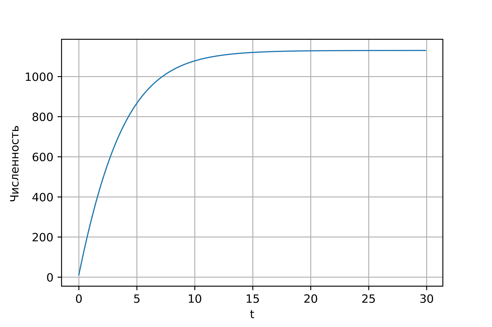
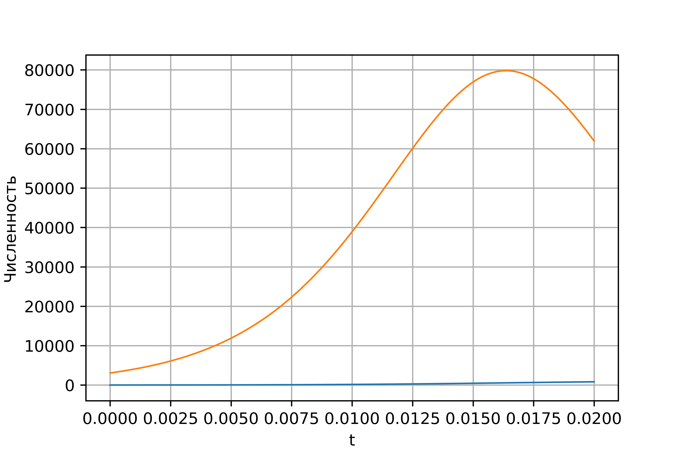
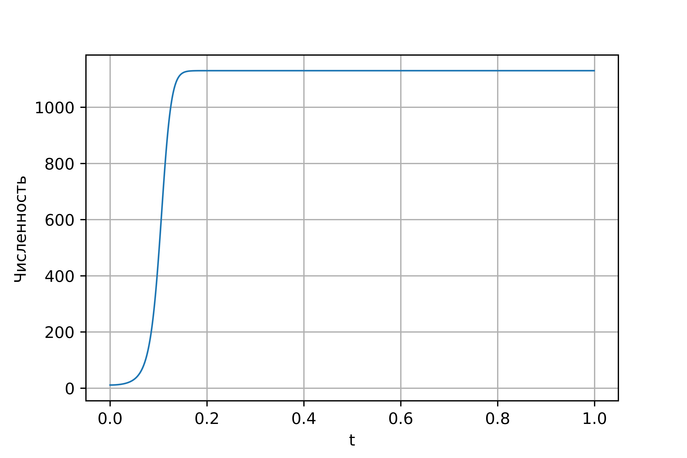

---
## Front matter
lang: ru-RU
title: "Отчет по лабораторной работе №7"
subtitle: "Эффективность рекламы"
author: |
	Поленикова Анна Алексеевна
institute: |
	\inst RUDN University, Moscow, Russian Federation
date: 2021

## Formatting
toc: false
slide_level: 2
theme: metropolis
mainfont: Times New Roman
romanfont: Times New Roman
sansfont: Times New Roman
monofont: Times New Roman
mainfontoptions: Ligatures=TeX
romanfontoptions: Ligatures=TeX
pdf-engine: xelatex
header-includes: 
 - \metroset{progressbar=frametitle,sectionpage=progressbar,numbering=fraction}
 - '\makeatletter'
 - '\beamer@ignorenonframefalse'
 - '\makeatother'
aspectratio: 43
section-titles: true
---

# Цель работы и задание

## Цель работы

Цель лабораторной работы №7 - ознакомление с моделью эффективности рекламы.

## Задание

Вариант 38

Постройте график распространения рекламы, математическая модель которой описывается
следующим уравнением:

1. $\frac{dn}{dt} = (0.25 + 0.000075n(t))(N-n(t))$
2. $\frac{dn}{dt} = (0.000075 + 0.25n(t))(N-n(t))$
3. $\frac{dn}{dt} = (0.25\sin (t) + 0.75\cdot t\cdot n(t))(N-n(t))$

При этом объем аудитории $N=1130$, в начальный момент о товаре знает 11 человек. Для
случая 2 определите в какой момент времени скорость распространения рекламы будет
иметь максимальное значение.

# Теоретическая справка

## Теоретическая справка

Организуется рекламная кампания нового товара или услуги. Необходимо,
чтобы прибыль будущих продаж с избытком покрывала издержки на рекламу.
Вначале расходы могут превышать прибыль, поскольку лишь малая часть
потенциальных покупателей будет информирована о новинке. Затем, при
увеличении числа продаж, возрастает и прибыль, и, наконец, наступит момент,
когда рынок насытиться, и рекламировать товар станет бесполезным.

## Теоретическая справка

Предположим, что торговыми учреждениями реализуется некоторая
продукция, о которой в момент времени $t$ из числа потенциальных покупателей 
$N$ знает лишь $n$ покупателей. Для ускорения сбыта продукции запускается реклама
по радио, телевидению и других средств массовой информации. После запуска
рекламной кампании информация о продукции начнет распространяться среди
потенциальных покупателей путем общения друг с другом. Таким образом, после
запуска рекламных объявлений скорость изменения числа знающих о продукции
людей пропорциональна как числу знающих о товаре покупателей, так и числу
покупателей о нем не знающих.

## Теоретическая справка

Модель рекламной кампании описывается следующими величинами.
Считаем, что $\frac{dn}{dt}$ - скорость изменения со временем числа потребителей,
узнавших о товаре и готовых его купить, $t$ - время, прошедшее с начала рекламной
кампании, $n(t)$ - число уже информированных клиентов. Эта величина
пропорциональна числу покупателей, еще не знающих о нем, это описывается
следующим образом: $\alpha _1(t)(N-n(t))$, где $N$ - общее число потенциальных
платежеспособных покупателей, $\alpha _1>0$ - характеризует интенсивность
рекламной кампании (зависит от затрат на рекламу в данный момент времени).

## Теоретическая справка

Помимо этого, узнавшие о товаре потребители также распространяют полученную
информацию среди потенциальных покупателей, не знающих о нем (в этом случае
работает т.н. сарафанное радио). Этот вклад в рекламу описывается величиной
$\alpha _2(t)n(t)(N-n(t))$, эта величина увеличивается с увеличением потребителей
узнавших о товаре. Математическая модель распространения рекламы описывается
уравнением:
$$\frac{dn}{dt}=(\alpha _1(t)+\alpha _2(t)n(t))(N-n(t))$$

При $\alpha _1(t)>>\alpha _2(t)$ получается модель типа модели Мальтуса,
а при $\alpha _1(t)<<\alpha _2(t)$ получаем уравнение логистической кривой.

# Выполнение лабораторной работы

## Решение для 1 случая

В результате выполнения программы были получены следующие результаты для 1 случая: (рис. -@fig:001)

{ #fig:001 width=70% }

## Решение для 2 случая

Для 2 случая был получен следующий график, а также значение $t=0.01625$, когда скорость распространения рекламы будет
иметь максимальное значение: (рис. -@fig:002)

{ #fig:002 width=70% }

## Решение для 3 случая

Для 3 случая был получен следующий график: (рис. -@fig:003)

{ #fig:003 width=70% }

# Выводы

## Выводы

В результате проделанной лабораторной работы была изучена модель эффективности рекламы.