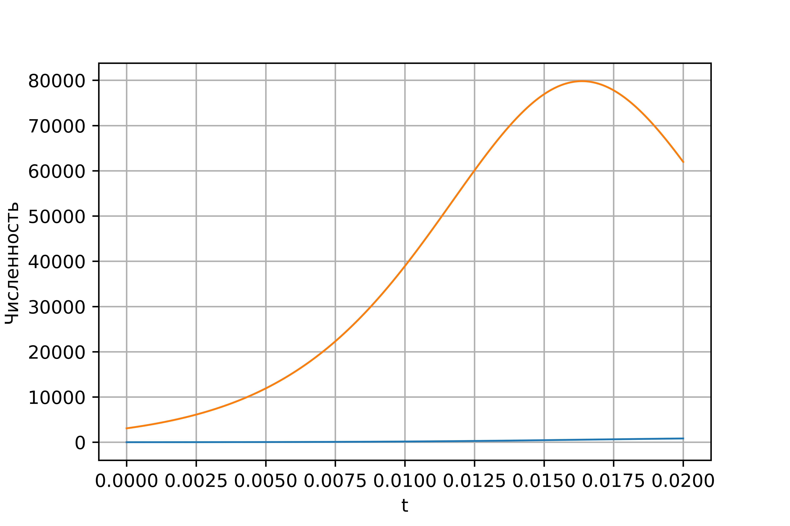
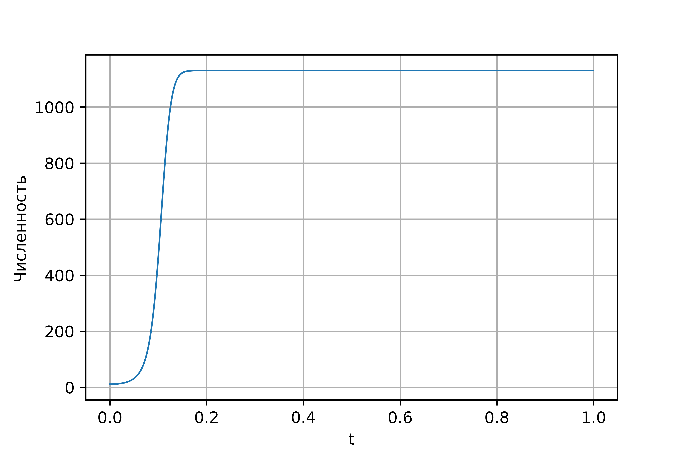

---
# Front matter
lang: ru-RU
title: "Отчет по лабораторной работе №7"
subtitle: "Эффективность рекламы"
author: "Поленикова Анна Алексеевна"

# Formatting
toc-title: "Содержание"
toc: true # Table of contents
toc_depth: 2
lof: true # List of figures
fontsize: 12pt
linestretch: 1.5
papersize: a4paper
documentclass: scrreprt
polyglossia-lang: russian
polyglossia-otherlangs: english
mainfont: DejaVuSerif
romanfont: DejaVuSerif
sansfont: DejaVuSans
monofont: DejaVuSansMono
mainfontoptions: Ligatures=TeX
romanfontoptions: Ligatures=TeX
sansfontoptions: Ligatures=TeX,Scale=MatchLowercase
monofontoptions: Scale=MatchLowercase
indent: true
pdf-engine: miktex
header-includes:
  - \linepenalty=10 # the penalty added to the badness of each line within a paragraph (no associated penalty node) Increasing the value makes tex try to have fewer lines in the paragraph.
  - \interlinepenalty=0 # value of the penalty (node) added after each line of a paragraph.
  - \hyphenpenalty=50 # the penalty for line breaking at an automatically inserted hyphen
  - \exhyphenpenalty=50 # the penalty for line breaking at an explicit hyphen
  - \binoppenalty=700 # the penalty for breaking a line at a binary operator
  - \relpenalty=500 # the penalty for breaking a line at a relation
  - \clubpenalty=150 # extra penalty for breaking after first line of a paragraph
  - \widowpenalty=150 # extra penalty for breaking before last line of a paragraph
  - \displaywidowpenalty=50 # extra penalty for breaking before last line before a display math
  - \brokenpenalty=100 # extra penalty for page breaking after a hyphenated line
  - \predisplaypenalty=10000 # penalty for breaking before a display
  - \postdisplaypenalty=0 # penalty for breaking after a display
  - \floatingpenalty = 20000 # penalty for splitting an insertion (can only be split footnote in standard LaTeX)
  - \raggedbottom # or \flushbottom
  - \usepackage{float} # keep figures where there are in the text
  - \floatplacement{figure}{H} # keep figures where there are in the text
---

# Цель работы

Цель лабораторной работы №7 - ознакомление с моделью эффективности рекламы.

# Задание

Вариант 38

Постройте график распространения рекламы, математическая модель которой описывается
следующим уравнением:

1. $\frac{dn}{dt} = (0.25 + 0.000075n(t))(N-n(t))$
2. $\frac{dn}{dt} = (0.000075 + 0.25n(t))(N-n(t))$
3. $\frac{dn}{dt} = (0.25\sin (t) + 0.75\cdot t\cdot n(t))(N-n(t))$

При этом объем аудитории $N=1130$, в начальный момент о товаре знает 11 человек. Для
случая 2 определите в какой момент времени скорость распространения рекламы будет
иметь максимальное значение.


# Теоретическая справка

Организуется рекламная кампания нового товара или услуги. Необходимо,
чтобы прибыль будущих продаж с избытком покрывала издержки на рекламу.
Вначале расходы могут превышать прибыль, поскольку лишь малая часть
потенциальных покупателей будет информирована о новинке. Затем, при
увеличении числа продаж, возрастает и прибыль, и, наконец, наступит момент,
когда рынок насытиться, и рекламировать товар станет бесполезным.

Предположим, что торговыми учреждениями реализуется некоторая
продукция, о которой в момент времени $t$ из числа потенциальных покупателей 
$N$ знает лишь $n$ покупателей. Для ускорения сбыта продукции запускается реклама
по радио, телевидению и других средств массовой информации. После запуска
рекламной кампании информация о продукции начнет распространяться среди
потенциальных покупателей путем общения друг с другом. Таким образом, после
запуска рекламных объявлений скорость изменения числа знающих о продукции
людей пропорциональна как числу знающих о товаре покупателей, так и числу
покупателей о нем не знающих.


Модель рекламной кампании описывается следующими величинами.
Считаем, что $\frac{dn}{dt}$ - скорость изменения со временем числа потребителей,
узнавших о товаре и готовых его купить, $t$ - время, прошедшее с начала рекламной
кампании, $n(t)$ - число уже информированных клиентов. Эта величина
пропорциональна числу покупателей, еще не знающих о нем, это описывается
следующим образом: $\alpha _1(t)(N-n(t))$, где $N$ - общее число потенциальных
платежеспособных покупателей, $\alpha _1>0$ - характеризует интенсивность
рекламной кампании (зависит от затрат на рекламу в данный момент времени).
Помимо этого, узнавшие о товаре потребители также распространяют полученную
информацию среди потенциальных покупателей, не знающих о нем (в этом случае
работает т.н. сарафанное радио). Этот вклад в рекламу описывается величиной
$\alpha _2(t)n(t)(N-n(t))$, эта величина увеличивается с увеличением потребителей
узнавших о товаре. Математическая модель распространения рекламы описывается
уравнением:
$$\frac{dn}{dt}=(\alpha _1(t)+\alpha _2(t)n(t))(N-n(t))$$

При $\alpha _1(t)>>\alpha _2(t)$ получается модель типа модели Мальтуса,
а при $\alpha _1(t)<<\alpha _2(t)$ получаем уравнение логистической кривой.

# Выполнение лабораторной работы

Для построения графиков эффективности рекламы для 3 случаев был написан следующий код:

```
import numpy as np
from scipy. integrate import odeint
import matplotlib.pyplot as plt
import math

t0=0
x0=11
N=1130
alpha1=0.25
alpha2=0.000075
t=np.arange(t0, 30, 0.1)

def eq(dx, t):
    x=dx
    return (alpha1+x*alpha2)*(N-x)

y=odeint(eq, x0, t)
graph1=plt.figure(facecolor='white')
plt.plot(t, y, linewidth=1)
plt.xlabel("t")
plt.ylabel("Численность")
plt.grid(True)
plt.show()
graph1.savefig('graph1.png', dpi=800)

alpha1=0.000075
alpha2=0.25
t=np.arange(t0, 0.02, 0.000001)
y=odeint(eq, x0, t)
dy=(alpha1+y*alpha2)*(N-y)
graph2=plt.figure(facecolor='white')
plt.plot(t, y, linewidth=1)
plt.plot(t, dy, linewidth=1)
plt.xlabel("t")
plt.ylabel("Численность")
plt.grid(True)
plt.show()
graph2.savefig('graph2.png', dpi=800)

def alpha1(t):
    alpha1=0.25*math.sin(t)
    return alpha1

def alpha2(t):
    alpha2=0.75*t
    return alpha2

t=np.arange(t0, 1, 0.001)

def eq1(dx, t):
    x=dx
    return (alpha1(t)+x*alpha2(t))*(N-x)

y=odeint(eq1, x0, t)
graph3=plt.figure(facecolor='white')
plt.plot(t, y, linewidth=1)
plt.xlabel("t")
plt.ylabel("Численность")
plt.grid(True)
plt.show()
graph3.savefig('graph3.png', dpi=800)
```

В результате выполнения программы были получены следующие результаты для 1 случая: (рис. -@fig:001)

{ #fig:001 width=70% }

Для 2 случая был получен следующий график, а также значение $t=0.01625$, когда скорость распространения рекламы будет
иметь максимальное значение: (рис. -@fig:002)

{ #fig:002 width=70% }

Для 3 случая был получен следующий график: (рис. -@fig:003)

{ #fig:003 width=70% }

# Выводы

В результате проделанной лабораторной работы была изучена модель эффективности рекламы.
