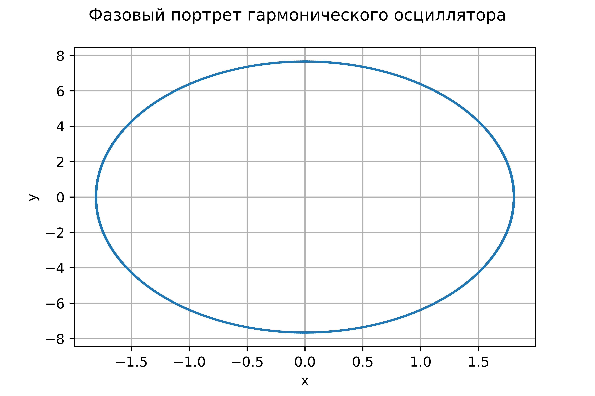
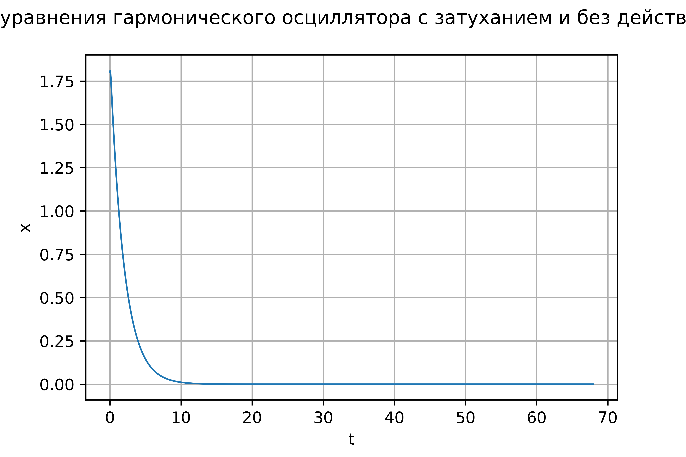
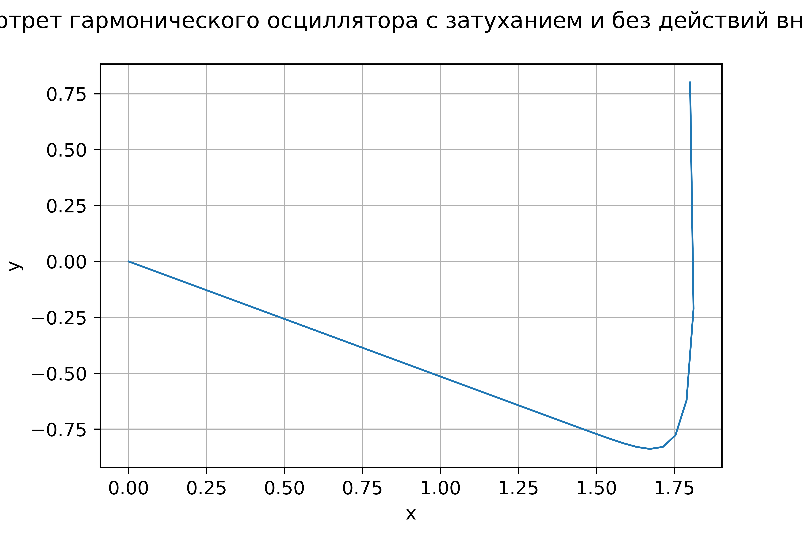
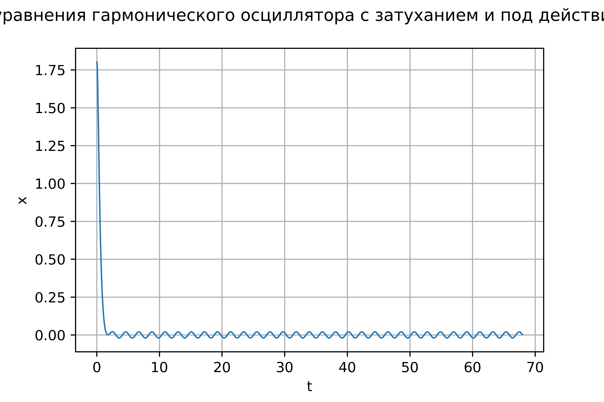
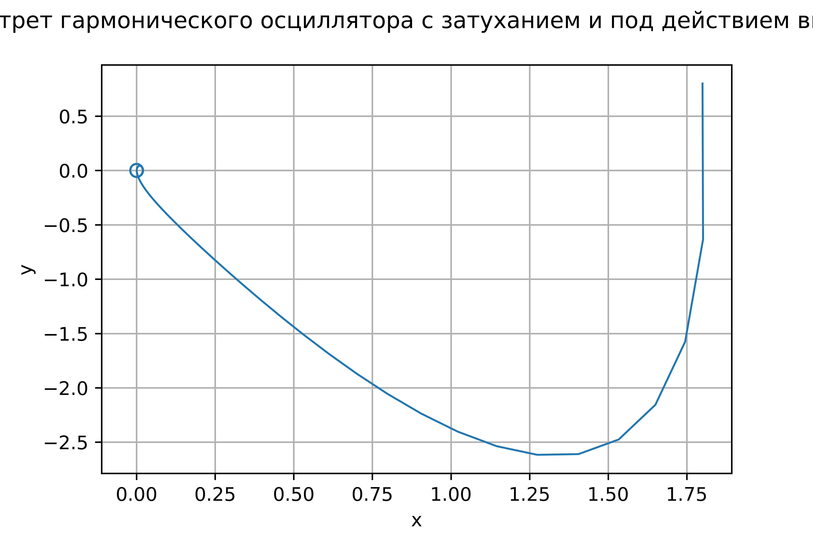

---
## Front matter
lang: ru-RU
title: Модель гармонического осциллятора
author: |
	Анна Поленикова
institute: |
	\inst RUDN University, Moscow, Russian Federation
date: 2021

## Formatting
toc: false
slide_level: 2
theme: metropolis
mainfont: Times New Roman
romanfont: Times New Roman
sansfont: Times New Roman
monofont: Times New Roman
mainfontoptions: Ligatures=TeX
romanfontoptions: Ligatures=TeX
pdf-engine: xelatex
header-includes: 
 - \metroset{progressbar=frametitle,sectionpage=progressbar,numbering=fraction}
 - '\makeatletter'
 - '\beamer@ignorenonframefalse'
 - '\makeatother'
aspectratio: 43
section-titles: true
---

# Цель работы и задание

## Цель работы
Цель лабораторной работы №4 - ознакомление с моделью гармонических колебаний и ее построение.

## Задание

Построить фазовый портрет гармонического осциллятора и решение уравнения гармонического осциллятора для следующих случаев

1. Колебания гармонического осциллятора без затуханий и без действий внешней силы x''+18x=0
2. Колебания гармонического осциллятора c затуханием и без действий внешней силы x''+18x'+9x=0
3. Колебания гармонического осциллятора c затуханием и под действием внешней силы x''+8x'+16x=0.5cos(3t) На интервале $t \in [0; 68]$ (шаг 0.05) с начальными условиями $x_0=1.8, y_0=0.8$

# Теоретическая справка

## Теоретическая справка

Движение грузика на пружинке, маятника, заряда в электрическом контуре, а
также эволюция во времени многих систем в физике, химии, биологии и других
науках при определенных предположениях можно описать одним и тем же
дифференциальным уравнением, которое в теории колебаний выступает в качестве
основной модели. Эта модель называется линейным гармоническим осциллятором.
Уравнение свободных колебаний гармонического осциллятора имеет
следующий вид:
$$\ddot{x}+2\gamma\dot{x}+\omega_0^2=0$$

## Теоретическая справка

При отсутствии потерь в системе ( $\gamma=0$ ) получаем уравнение консервативного осциллятора энергия колебания которого сохраняется во времени.
$$\ddot{x}+\omega_0^2x=0$$
Для однозначной разрешимости уравнения второго порядка необходимо задать два начальных условия вида
 
$$
 \begin{cases}
	x(t_0)=x_0
	\\   
	\dot{x(t_0)}=y_0
 \end{cases}
$$

## Теоретическая справка

Уравнение второго порядка можно представить в виде системы двух уравнений первого порядка:
$$
 \begin{cases}
	x=y
	\\   
	y=-\omega_0^2x
 \end{cases}
$$

Начальные условия для системы примут вид:
$$
 \begin{cases}
	x(t_0)=x_0
	\\   
	y(t_0)=y_0
 \end{cases}
$$

# Выполнение лабораторной работы

## Случай 1

$$\ddot{x}+18x=0$$

{ #fig:001 width=70% }

## Случай 1

$$\ddot{x}+18x=0$$

{ #fig:002 width=70% }

## Случай 2

$$\ddot{x}+18\dot{x}+9x=0$$

{ #fig:003 width=70% }

## Случай 2

$$\ddot{x}+18\dot{x}+9x=0$$

{ #fig:004 width=70% }

## Случай 3

$$\ddot{x}+8\dot{x}+16x=0.5\cos{3t}$$

{ #fig:005 width=70% }

## Случай 3

$$\ddot{x}+8\dot{x}+16x=0.5\cos{3t}$$

{ #fig:006 width=70% }

# Выводы

## Выводы

В результате проделанной лабораторной работы №4 была изучена и построена модель гармонических колебаний.