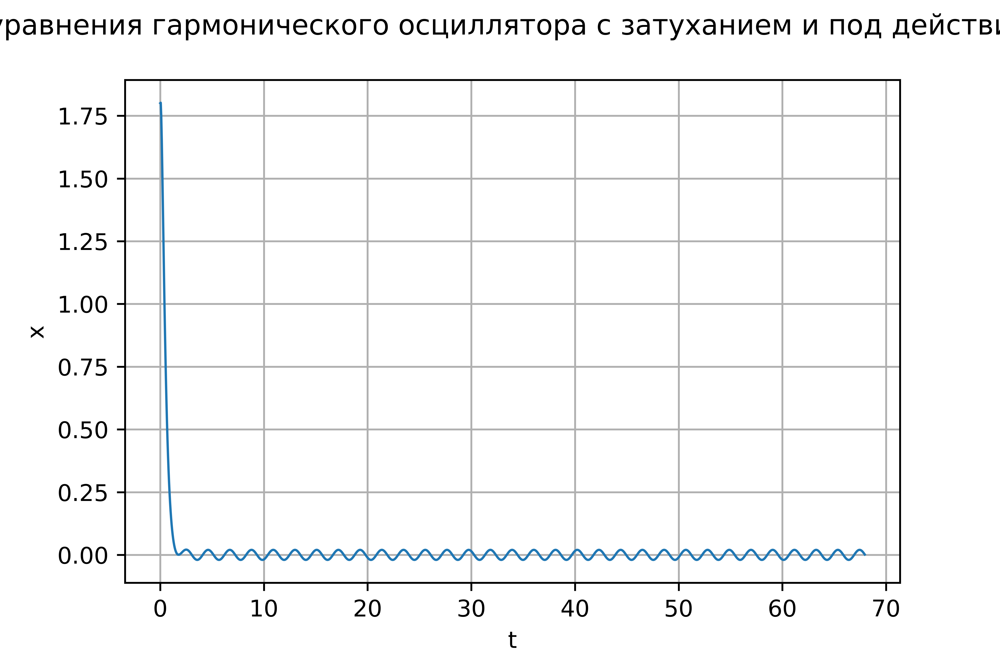

---
# Front matter
lang: ru-RU
title: "Отчет по лабораторной работе №4"
subtitle: "Модель гармонических колебаний"
author: "Поленикова Анна Алексеевна"

# Formatting
toc-title: "Содержание"
toc: true # Table of contents
toc_depth: 2
lof: true # List of figures
fontsize: 12pt
linestretch: 1.5
papersize: a4paper
documentclass: scrreprt
polyglossia-lang: russian
polyglossia-otherlangs: english
mainfont: DejaVuSerif
romanfont: DejaVuSerif
sansfont: DejaVuSans
monofont: DejaVuSansMono
mainfontoptions: Ligatures=TeX
romanfontoptions: Ligatures=TeX
sansfontoptions: Ligatures=TeX,Scale=MatchLowercase
monofontoptions: Scale=MatchLowercase
indent: true
pdf-engine: miktex
header-includes:
  - \linepenalty=10 # the penalty added to the badness of each line within a paragraph (no associated penalty node) Increasing the value makes tex try to have fewer lines in the paragraph.
  - \interlinepenalty=0 # value of the penalty (node) added after each line of a paragraph.
  - \hyphenpenalty=50 # the penalty for line breaking at an automatically inserted hyphen
  - \exhyphenpenalty=50 # the penalty for line breaking at an explicit hyphen
  - \binoppenalty=700 # the penalty for breaking a line at a binary operator
  - \relpenalty=500 # the penalty for breaking a line at a relation
  - \clubpenalty=150 # extra penalty for breaking after first line of a paragraph
  - \widowpenalty=150 # extra penalty for breaking before last line of a paragraph
  - \displaywidowpenalty=50 # extra penalty for breaking before last line before a display math
  - \brokenpenalty=100 # extra penalty for page breaking after a hyphenated line
  - \predisplaypenalty=10000 # penalty for breaking before a display
  - \postdisplaypenalty=0 # penalty for breaking after a display
  - \floatingpenalty = 20000 # penalty for splitting an insertion (can only be split footnote in standard LaTeX)
  - \raggedbottom # or \flushbottom
  - \usepackage{float} # keep figures where there are in the text
  - \floatplacement{figure}{H} # keep figures where there are in the text
---

# Цель работы

Цель лабораторной работы №4 - ознакомление с моделью гармонических колебаний и ее построение.

# Задание

Вариант №37

Постройте фазовый портрет гармонического осциллятора и решение уравнения гармонического осциллятора для следующих случаев

1. Колебания гармонического осциллятора без затуханий и без действий внешней силы x''+18x=0
2. Колебания гармонического осциллятора c затуханием и без действий внешней силы x''+18x'+9x=0
3. Колебания гармонического осциллятора c затуханием и под действием внешней силы x''+8x'+16x=0.5cos(3t) На интервале $t \in [0; 68]$ (шаг 0.05) с начальными условиями x0=1.8, y0=0.8

# Выполнение лабораторной работы

Для каждого из случаев был написан код на Python и получены графики.

1 случай:
```
w=18.0
tmax=68.0
step=0.05
f0=[1.8, 0.8]

def F(f, t):
    f1, f2=f
    return [f2, -w*f1]

t=np.arange(0, tmax, step)
w1=odeint(F, f0, t)
y11=w1[:,0]
y21=w1[:,1]

graph=plt.figure(facecolor='white')
plt.plot(t, y11, linewidth=1)
plt.suptitle('График решения уравнения гармонического осциллятора')
plt.ylabel("x")
plt.xlabel("t")
plt.grid(True)
plt.show()
```

На изображении ниже показан график решения уравнения для 1 случая (рис. -@fig:001)

{ #fig:001 width=70% }
```
graph2=plt.figure(facecolor='white')
plt.plot(y11, y21, linewidth=1)
plt.suptitle('Фазовый портрет гармонического осциллятора')
plt.ylabel("y")
plt.xlabel("x")
plt.grid(True)
plt.show()
```
На изображении ниже показан фазовый портрет гармонического осциллятора для 1 случая  (рис. -@fig:002)

{ #fig:002 width=70% }

2 случай: 
```
w2=9.0
g=18.0

def F1(f, t):
    f1, f2=f
    return [f2, -w2*f1-g*f2]

t=np.arange(0, tmax, step)
w3=odeint(F1, f0, t)
y11=w3[:,0]
y21=w3[:,1]

graph3=plt.figure(facecolor='white')
plt.plot(t, y11, linewidth=1)
plt.suptitle('График решения уравнения гармонического осциллятора c затуханием и без действий внешней силы')
plt.ylabel("x")
plt.xlabel("t")
plt.grid(True)
plt.show()
```
На изображении ниже показан график решения уравнения для 2 случая (рис. -@fig:003)

{ #fig:003 width=70% }
```
graph4=plt.figure(facecolor='white')
plt.plot(y11, y21, linewidth=1)
plt.suptitle('Фазовый портрет гармонического осциллятора c затуханием и без действий внешней силы')
plt.ylabel("y")
plt.xlabel("x")
plt.grid(True)
plt.show()
```
На изображении ниже показан фазовый портрет гармонического осциллятора для 2 случая  (рис. -@fig:004)

{ #fig:004 width=70% }

3 случай:
```
w=16.0
g=8.0

def f(t):
    f=0.5*math.cos(3*t)
    return f

def F(y, t):
    y1, y2=y
    return [y2, -w*y1-g*y2+f(t)]

t=np.arange(0, tmax, step)
w1=odeint(F, f0, t)
y11=w1[:,0]
y21=w1[:,1]

graph5=plt.figure(facecolor='white')
plt.plot(t, y11, linewidth=1)
plt.suptitle('График решения уравнения гармонического осциллятора c затуханием и под действием внешней силы')
plt.ylabel("x")
plt.xlabel("t")
plt.grid(True)
plt.show()
```
На изображении ниже показан график решения уравнения для 3 случая (рис. -@fig:005)

{ #fig:005 width=70% }
```
graph6=plt.figure(facecolor='white')
plt.plot(y11, y21, linewidth=1)
plt.suptitle('Фазовый портрет гармонического осциллятора c затуханием и под действием внешней силы')
plt.ylabel("y")
plt.xlabel("x")
plt.grid(True)
plt.show()
```
На изображении ниже показан фазовый портрет гармонического осциллятора для 3 случая  (рис. -@fig:006)

{ #fig:006 width=70% }

# Выводы

В результате проделанной лабораторной работы №4 была изучена и построена модель гармонических колебаний.
